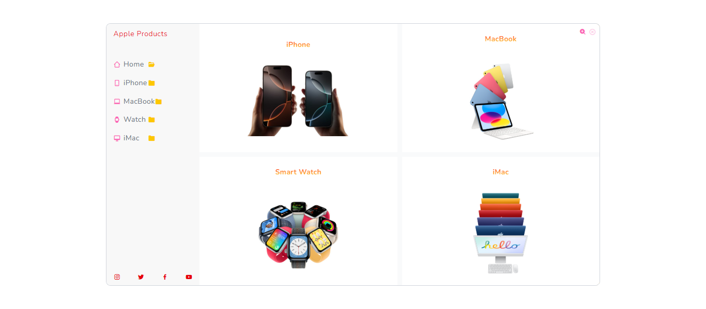
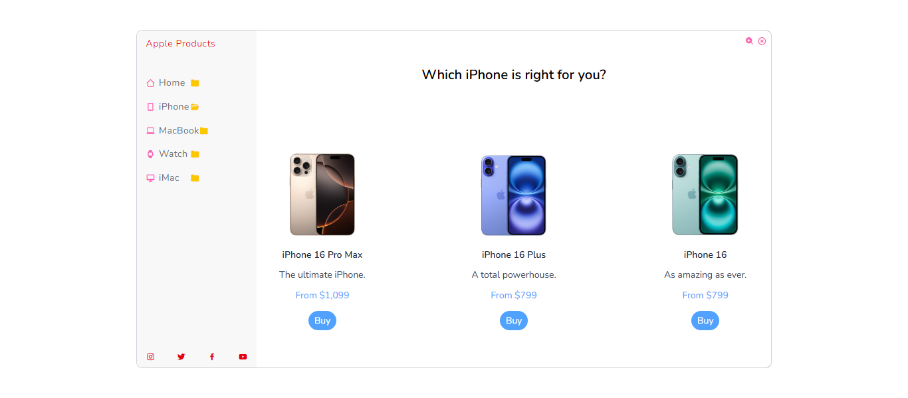
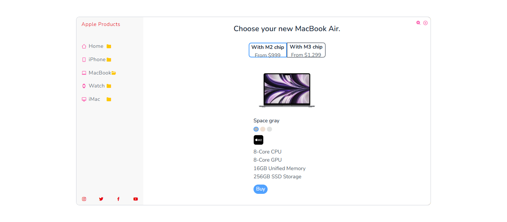
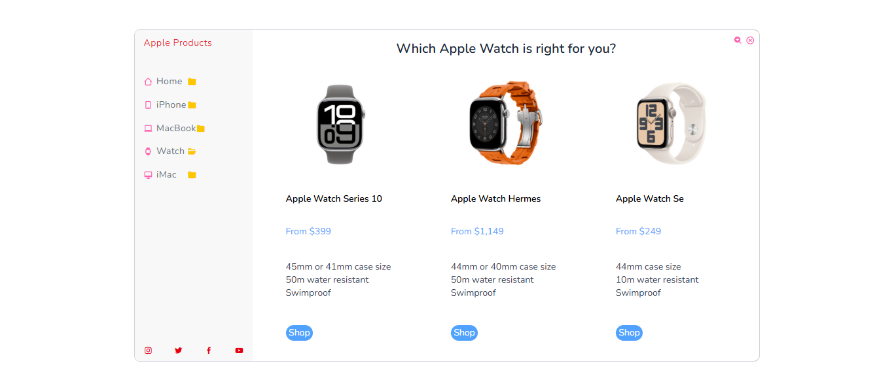
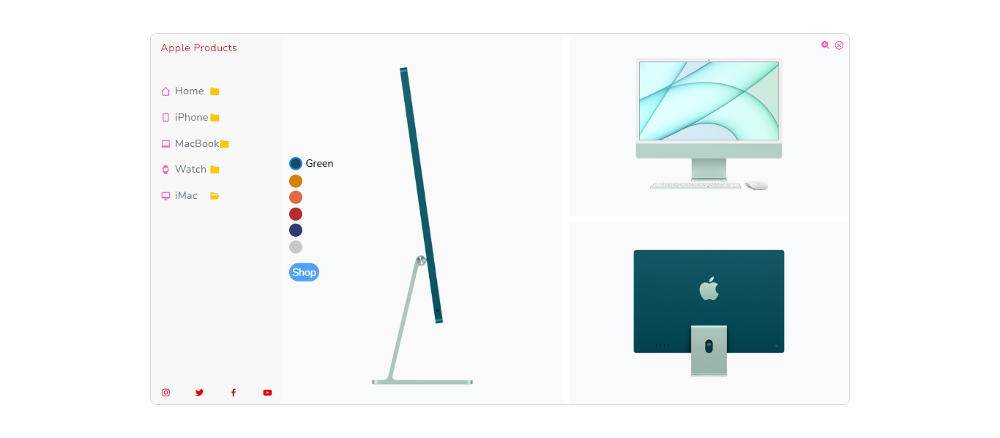
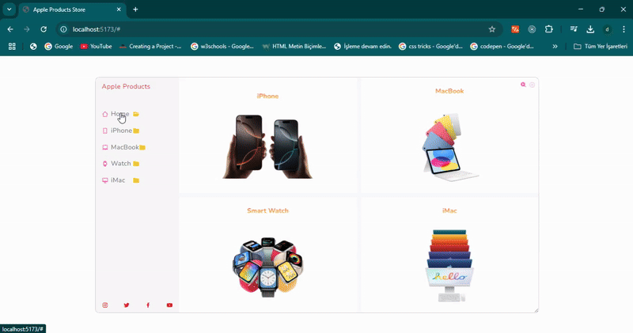

🚀 Apple Ürünleri Mağazası - Modern ve Duyarlı Bir Alışveriş Deneyimi! 🍏
React 19 ve Tailwind CSS 4.0 kullanarak tamamen duyarlı bir Apple Ürünleri Mağazası geliştirdim! 🎉 Bu proje, pürüzsüz sayfa geçişleri, etkileşimli ürün seçimi, dinamik renk önizlemeleri ve Apple’ın minimalist tasarım anlayışından esinlenen modern bir kullanıcı arayüzü sunuyor.

🔹 Teknolojiler: React 19 ⚛️ | Tailwind CSS 4.0 🎨
🔹 Öne Çıkan Özellikler:
✅ Dinamik ve akıcı sayfa geçişleri
✅ Ürün renklerini anında önizleme
✅ Mobil ve masaüstü için tamamen duyarlı yapı
✅ Şık ve kullanıcı dostu tasarım

# React + Vite

This template provides a minimal setup to get React working in Vite with HMR and some ESLint rules.

Currently, two official plugins are available:

- [@vitejs/plugin-react](https://github.com/vitejs/vite-plugin-react/blob/main/packages/plugin-react/README.md) uses [Babel](https://babeljs.io/) for Fast Refresh
- [@vitejs/plugin-react-swc](https://github.com/vitejs/vite-plugin-react-swc) uses [SWC](https://swc.rs/) for Fast Refresh

## Expanding the ESLint configuration

If you are developing a production application, we recommend using TypeScript and enable type-aware lint rules. Check out the [TS template](https://github.com/vitejs/vite/tree/main/packages/create-vite/template-react-ts) to integrate TypeScript and [`typescript-eslint`](https://typescript-eslint.io) in your project.
# ReactJS-Tailwind-CSS-4-Responsive-Apple-Products-Store-
